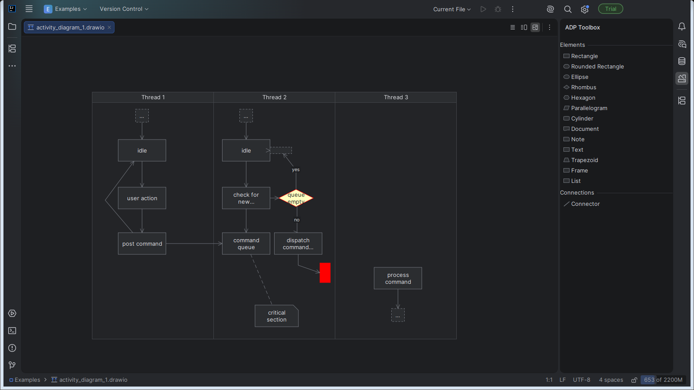

# A Different Perspective (ADP)

[](https://github.com/etalii-adp/etalii.adp.ide.intellij/actions/workflows/build.yml?query=branch%3Adevelop)

ADP is an IntelliJ Platform plug-in that adds specialized tools for text-based files: diagrams, designers and editors (see the [ADP terminology](https://github.com/etalii-adp/etalii.adp/blob/develop/docs/terminology.md)). This plug-in brings two diagrams. Each tool opens in a real editor in the IDE: it is registered for its file type, uses the IDE's own undo and redo, has the usual modified state and save behaviour, and sits next to the IDE's text editor on the same document. The text is always the source of truth: the tool re-reads it after every change, and every visual edit changes only the text it has to.



Two file formats are supported. **FreeMind mind maps** (`.mm`):

- A FreeMind `.mm` file opens in the mind map. Other `.mm` files, such as Objective-C++ source, open with whatever editor would otherwise apply.
- The map is drawn around its root, with branches on their recorded side, folding, arrow links, icons, colours, fonts, links and notes.
- You can add, rename, delete, move, drag and fold nodes from the keyboard or the context menu. Every change is one named step in Edit > Undo, shared with the text editor.
- A file saved without edits is byte-identical. Edits leave everything else in the file as it was.
- The Structure tool window lists the node tree. **File > New > FreeMind Mind Map** creates a new map.

**draw.io diagrams** (`.drawio`, uncompressed):

- A `.drawio` file whose content is a draw.io diagram opens in the diagram: shapes, dashed, curved and orthogonal edges, arrowheads, labels and swimlanes. `.drawio.svg` and `.drawio.png` files are left alone.
- Add shapes from the toolbox, connect them, move, resize and delete them, and edit their fill colour, line style and labels. Everything the diagram does not show, such as other pages, groups and unknown shapes, is kept as it is.
- A compressed file opens in the text view, with an explanation of how to save it uncompressed from draw.io.

Every diagram shares two tool windows on the right:

- **ADP Toolbox** lists the element and connection types of the selected diagram. Drag an entry onto the canvas, or press Enter on it to add it in the middle.
- **ADP Properties** shows the properties of the selection and edits them, several items at once where they share a property. Double-click a text on the canvas, or press F2, to edit it in place.

Both diagrams are built on the diagram framework in `core`. To build a diagram for a format of your own, follow the [diagram guide](docs/diagram-guide.md).
## Supported IDEs

Every IntelliJ Platform IDE from release 2026.2 (build 262) on. The build verifies the plug-in against IntelliJ IDEA, Rider, WebStorm, PyCharm, CLion, GoLand, PhpStorm and RubyMine. The plug-in makes no network access at runtime.

## Install from disk

1. Build the plug-in (below), or take a released `etalii-adp-<version>.zip`.
2. In the IDE, open **Settings > Plugins**, click the gear icon, choose **Install Plugin from Disk...** and pick the zip.
3. Restart the IDE when asked.

## Build

You need a JDK to start Gradle; the Java toolchain the platform requires is downloaded when it is not installed. The first build also downloads the IntelliJ Platform, and the integration tests and verification download the IDEs they run against.

```sh
./gradlew build            # compiles, runs every test, verifies the plug-in, produces the zip
./gradlew test             # format layer and headless platform tests
./gradlew integrationTest  # the plug-in installed into real IDEs (slow)
./gradlew runIde           # a sandbox IntelliJ IDEA with the plug-in installed
./gradlew captureScreenshots  # retakes docs/screenshots/ in a real IntelliJ IDEA (see its readme)
```

The installable plug-in is `build/distributions/etalii-adp-<version>.zip`. On Windows use `gradlew.bat`.

The layout:

| Path | What it is |
|---|---|
| `core` | The tool framework, including the diagram framework (definitions, mapping contract, canvas, toolbox, property panel, XML helpers). It knows no file format. |
| `freemind` | The FreeMind file format: parser, text edits, the mind map, actions. The vendored example maps are in `freemind/testdata/examples/`, each with its licence. |
| `drawio` | The draw.io diagram: definition, mapping and registration. The example diagrams in `drawio/testdata/examples/` are decompressed draw.io templates (CC-BY-4.0), each with its licence. |
| `testing` | `ToolDriver` and `DiagramDriver`, the test kit the tool tests use. |
| `src/integrationTest` | Tests that install the built zip into real IDEs. |

### Integration test settings

These environment variables are optional:

| Variable | Effect |
|---|---|
| `ADP_IT_PRODUCTS` | A comma-separated list of products to run, for example `IntelliJ IDEA,Rider`. All run when it is not set. |
| `ADP_IDE_HOME_<CODE>` | Use an installed IDE instead of downloading it, for example `ADP_IDE_HOME_IU`. |
| `ADP_IDEA_LICENSE` | An IntelliJ IDEA Ultimate licence key, or a path to one. Without it the licensed run is skipped. |
| `ADP_IDE_TESTS_HOME` | Where the tests keep the IDEs they download and the folders they run in (also the Gradle property `adpIdeTestsHome`). |

The downloaded IDEs take about 30 GB. They are kept in one per-user folder that every clone and worktree shares: `%LOCALAPPDATA%\etalii-adp\ide-tests-home` on Windows, `$XDG_CACHE_HOME/etalii-adp/ide-tests-home` (or `~/.cache/...`) elsewhere. Older checkouts kept them in `out/ide-tests` inside the repository; that folder can be deleted.

### Trying the plug-in in a sandbox IDE

`./gradlew runIde` starts IntelliJ IDEA with the plug-in installed and opens `example-project`, a folder with copies of the example maps and diagrams. The copies are refreshed on every run; other files you put there are kept. Edits never touch the vendored examples.

The sandbox lives in `.intellijPlatform/sandbox/EtAlii.Adp.IntelliJ/<platform>/`: `config_runIde` (settings), `system_runIde` (indexes), `plugins_runIde`, `log_runIde` and `example-project`. `log_runIde` holds `idea.log`, freeze reports, and any heap dump (`java_pid*.hprof`) or crash log (`hs_err_pid*.log`). Delete the folder to reset the sandbox.

The build excludes `out`, `.intellijPlatform` and `.claude/worktrees` from the IDE project, so opening this repository in an IDE does not index sandboxes, downloads or nested worktrees.

## Check compatibility with FreeMind 1.0.1

FreeMind is GPL, so it cannot be a build dependency. Its check is opt-in: point `FREEMIND_HOME` at a FreeMind 1.0.1 installation, the folder that holds `lib/freemind.jar`, and run the test.

```sh
FREEMIND_HOME=/opt/freemind ./gradlew :freemind:test --tests '*FreeMindCompatibilityTest'
```

Each example map is edited and saved, then loaded with FreeMind's own reader in a separate JVM. The test then compares the tree and text with what the mind map showed. Without `FREEMIND_HOME` the test is skipped.

## How work is done here

Every change starts as a specification, using GitHub Spec Kit. See `CLAUDE.md` and the features under `specs/`.

## Licence

Apache License, Version 2.0. See `LICENSE`. The example maps and diagrams keep their own licences, recorded in the `.LICENSE` file beside each one.

The build checks that every third-party library the plug-in ships has an Apache-2.0-compatible licence (`./gradlew verifyDependencyLicences`, part of `check`, against `gradle/allowed-licences.properties`). Today it ships none.

The plug-in zip contains only this project's code. The build and test dependencies, checked for compatibility with Apache-2.0:

| Dependency | Used for | Licence | Compatible |
|---|---|---|---|
| Gradle and the Gradle wrapper | Build | Apache-2.0 | Yes |
| IntelliJ Platform Gradle Plugin | Build, plug-in verification | Apache-2.0 | Yes |
| Foojay toolchain resolver | Build, provisions the JDK | Apache-2.0 | Yes |
| IntelliJ Platform (intellij-community) | Compiled against, not bundled | Apache-2.0 | Yes |
| IntelliJ Plugin Verifier | Build verification | Apache-2.0 | Yes |
| IntelliJ Platform test framework, Starter and Driver | Tests | Apache-2.0 | Yes |
| IntelliJ Platform IDEs (IDEA, Rider, WebStorm, PyCharm and others) | Downloaded to test and verify against, not bundled or redistributed | JetBrains product licences | Yes, not distributed |
| Kotlin standard library | Integration tests | Apache-2.0 | Yes |
| kotlinx.coroutines | Integration tests | Apache-2.0 | Yes |
| TeamCity service messages | Integration tests | Apache-2.0 | Yes |
| JUnit Jupiter and JUnit Platform 5.13 | Tests | EPL-2.0 | Yes, test-only, not distributed |
| JUnit 4.13 | Tests | EPL-1.0 | Yes, test-only, not distributed |
| Hamcrest 1.3 (through JUnit 4) | Tests | BSD-3-Clause | Yes |
